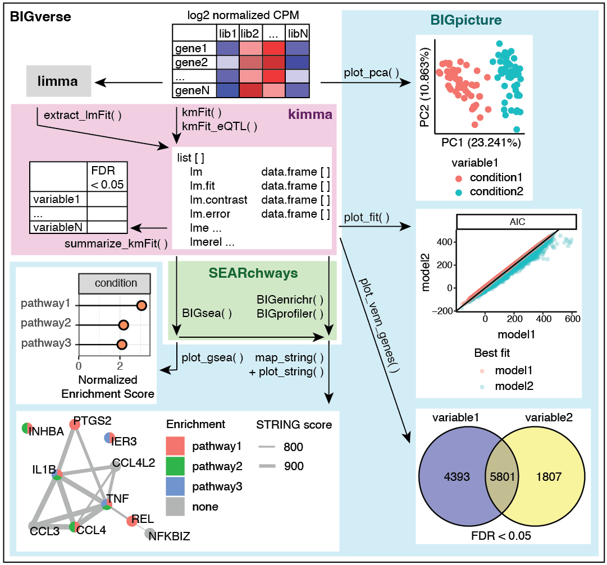

# kimma vignette

The identification of differentially expressed genes (DEGs) from transcriptomic datasets is a major avenue of research across diverse disciplines. Current bioinformatic tools support a number of experimental designs including covariates, random effects, and blocking. However, covariance matrices are not yet among the features available. Here, we introduce kimma for kinship in mixed model analysis, an open-source R package that provides linear and linear mixed effects modeling of RNA-seq data including all previous designs plus covariance random effects. kimma equals or outcompetes other DEG pipelines in terms of sensitivity, computational time, and model complexity. 

In particular, kimma provides:

* A single function `kmFit` for flexible linear modeling of fixed, random, and complex random effects
* Multi-processor architecture for reduced computational time
* Multiple model fit measures such as AIC and BIC
* Easy incorporation with data visualization and downstream analyses in the `BIGverse` (see below)

## Vignettes

Main `kimma` package vignette
https://bigslu.github.io/kimma_vignette/kimma_vignette.html

Additional tutorials related to RNA-seq data analysis

1. [fastq to counts](https://bigslu.github.io/tutorials/RNAseq/1.RNAseq_fastq.to.counts.html): Sequence quality filtering, alignment, and counts with [SEAsnake](https://bigslu.github.io/SEAsnake/vignette/SEAsnake_vignette.html): Software to our run pipeline
2. [Counts to voom](https://bigslu.github.io/tutorials/RNAseq/2.RNAseq_counts.to.voom.html): Count quality filtering and normalization with `edgeR` and `limma`
3. [Voom to DEG](https://bigslu.github.io/tutorials/RNAseq/3.RNAseq_voom.to.DEG.html): Additional information on how to pick a best fit model
5. [RNAseq modules](https://bigslu.github.io/tutorials/RNAseq/4.RNAseq_modules.html): Gene co-expression modules with `WGCNA`
6. [Gene set analysis](https://bigslu.github.io/tutorials/RNAseq/5.RNAseq_gene.set.analysis.html): Including hypergeometric enrichment, `enrichr`, gene set enrichment analysis (GSEA), and STRING networks
